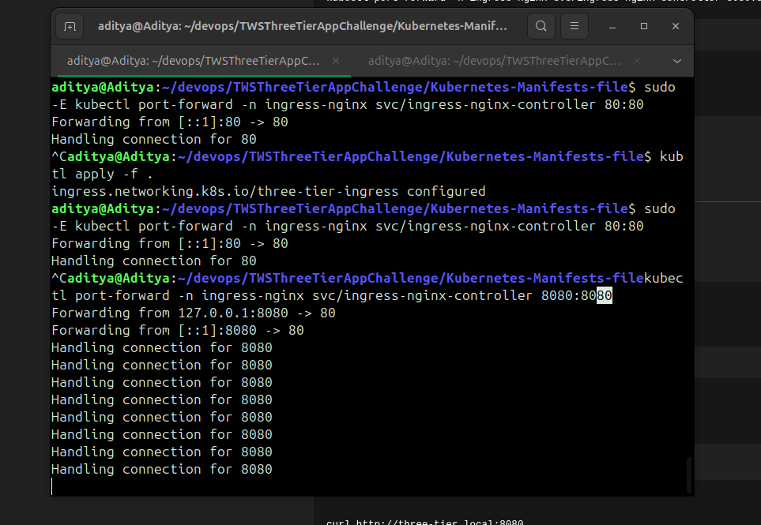
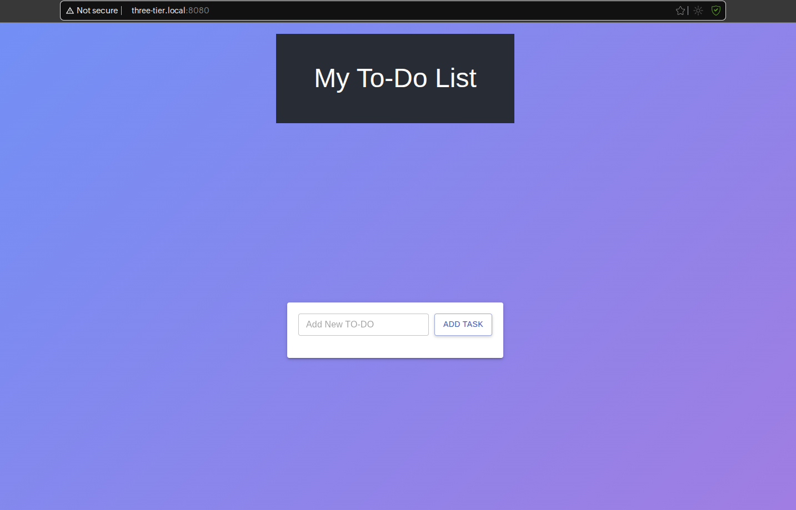

# 🧱 Three-Tier Application Deployment on Kubernetes (Kind + Ingress)

This repository demonstrates the end-to-end deployment of a **Three-Tier Web Application** using **Docker**, **Kubernetes (Kind)**, and **NGINX Ingress Controller**.

The application is deployed inside a local Kubernetes cluster (Kind) and accessed via **Ingress**, not individual port-forwards.

This project focuses on **real DevOps practices**:
* Containerized frontend & backend
* Kubernetes manifests
* Ingress-based routing
* Debugging, logs, and troubleshooting

---

## 🧠 Architecture Overview

```
User
 │
 ▼
Ingress (NGINX)
 │
 ├── Frontend Service
 │
 └── Backend Service
      │
      └── Database
```

---

## 🛠️ Tech Stack

* **Docker** - Containerization
* **Kubernetes (Kind)** - Local Kubernetes cluster
* **NGINX Ingress Controller** - Traffic routing
* **kubectl** - Kubernetes CLI
* **Linux** - Operating system

---

## 📁 Repository Structure

```
.
├── backend/
│   ├── models/
│   ├── routes/
│   ├── .dockerignore
│   ├── db.js
│   ├── Dockerfile
│   ├── index.js
│   ├── package-lock.json
│   └── package.json
├── frontend/
│   ├── public/
│   ├── src/
│   ├── .dockerignore
│   ├── Dockerfile
│   ├── package-lock.json
│   └── package.json
├── image/
│   ├── App-Running.png
│   └── Port-forward.png
├── Kubernetes-Manifests-file/
│   ├── Backend/
│   │   ├── deployment.yaml
│   │   └── service.yaml
│   ├── Database/
│   │   ├── deployment.yaml
│   │   ├── pv.yaml
│   │   ├── pvc.yaml
│   │   ├── secrets.yaml
│   │   └── service.yaml
│   ├── Frontend/
│   │   ├── deployment.yaml
│   │   └── service.yaml
│   └── ingress.yaml
└── README.md
```

---

## 🚀 Step 1: Create Kubernetes Cluster Using Kind

**Kind cluster creation is mandatory before applying manifests.**

I use my own Kind setup repository 👇  
🔗 [Kind Setup Repo](https://github.com/Aditya-das-4707-e/kubectl-k8s)

### Install Kind

```bash
curl -Lo ./kind https://kind.sigs.k8s.io/dl/v0.23.0/kind-linux-amd64
chmod +x kind
sudo mv kind /usr/local/bin/
```

### Create Cluster

```bash
kind create cluster --name three-tier-cluster
```

### Verify Cluster

```bash
kubectl get nodes
```

---

## 🌐 Step 2: Install NGINX Ingress Controller (Kind)

```bash
kubectl apply -f https://raw.githubusercontent.com/kubernetes/ingress-nginx/main/deploy/static/provider/kind/deploy.yaml
```

Wait until ingress controller is ready:

```bash
kubectl get pods -n ingress-nginx
```

---

## 📦 Step 3: Deploy Application (Apply ALL YAMLs)

⚠️ **This project runs via Ingress, not individual services.**

Apply all Kubernetes manifests at once:

```bash
kubectl apply -f Kubernetes-Manifests-file/
```

### Verify Deployment

```bash
kubectl get pods
kubectl get svc
kubectl get ingress
```

---

## 🌍 Step 4: Configure Host Entry

Edit `/etc/hosts`:

```bash
sudo nano /etc/hosts
```

Add the following line:

```
127.0.0.1 three-tier.local
```

### Access the Application

Open your browser and navigate to:

```
http://three-tier.local
```

---

## 🖼️ Application Proof (Images)

### 🔁 Port Forward (Debug Purpose Only)
*Not used in final flow, only for testing*



### ✅ Application Running via Ingress



---

## 🪵 Logs & Debugging

### Check Pods

```bash
kubectl get pods
```

### View Logs

```bash
kubectl logs <pod-name>
```

**Example:**

```bash
kubectl logs frontend-5f9d6c6b7d-xyz
kubectl logs backend-6d4c7b88c9-abc
```

### Describe Resource

```bash
kubectl describe pod <pod-name>
kubectl describe ingress
```

---

## 🛠️ Common Problem & Fix

### ❌ Problem: Port Already Occupied During Port-Forward

Sometimes `kubectl port-forward` fails because an unknown service is already using the port.

### ✅ Solution: Clean the Port

I built a dedicated tool for this 👇  
🔗 [Ghost Port Cleanup Tool](https://github.com/Aditya-das-4707-e/Ghost-Port-Cleanup-Tool)

Use it to:
* Detect unknown services
* Safely free occupied ports
* Avoid killing critical system processes

---

## 🎯 Key Highlights

* ✅ Kind-based Kubernetes cluster
* ✅ Ingress-driven access (real-world approach)
* ✅ No cloud dependency
* ✅ Clean logs & debugging flow
* ✅ Production-style deployment mindset

---

## 📝 License

This project is open-source and available under the [MIT License](LICENSE).

---

## 🤝 Contributing

Contributions, issues, and feature requests are welcome!  
Feel free to check the [issues page](../../issues).

---

## 👨‍💻 Author

**Aditya Das**

* GitHub: [@Aditya-das-4707-e](https://github.com/Aditya-das-4707-e)

---

## ⭐ Show your support

Give a ⭐️ if this project helped you!